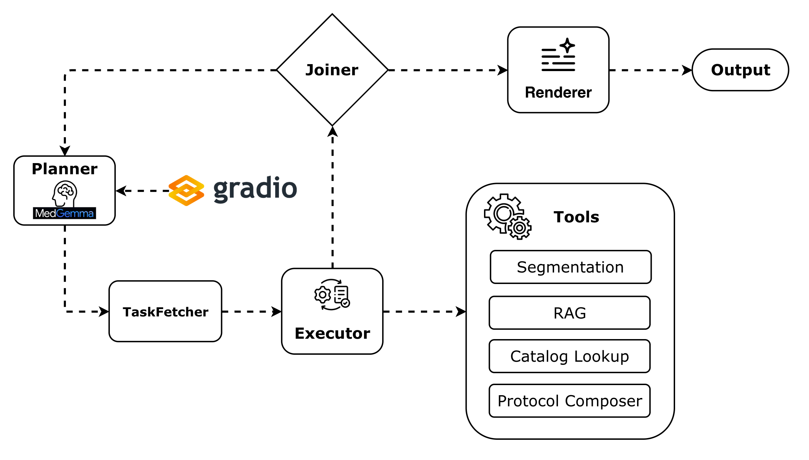
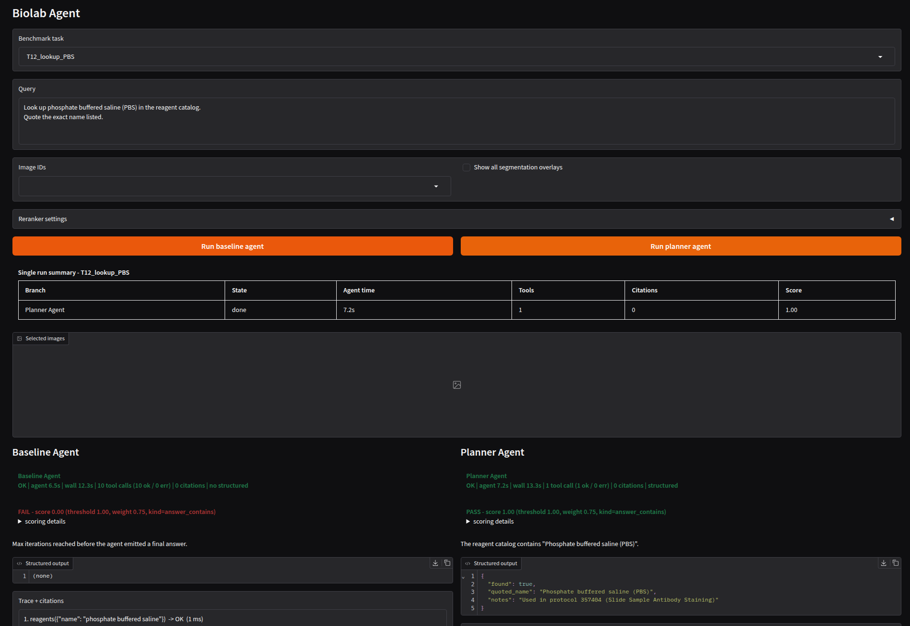

# biolab-agent-planner

This repository is a development of [prakash-aryan/biolab-agent-base](biolab-agent-base). 
**Final score: 15/15 passes · 0.91 overall** (baseline: 11/15 · 0.71)

#### A video of running both agent via gradio is available here:

- https://www.youtube.com/watch?v=83FldTK8rKI


## What have been changed:


The baseline fails 4 queries that each point to a different layer of the stack. Following modifications added to the repository:

- **New Agent:** `PlannerAgent` — five-component LLMCompiler (Planner → TaskFetcher → Executor → Joiner → Renderer) replacing the baseline's 10-turn agent. System prompt split into nested single-responsibility prompts with schema-constrained decoding per component.

- **RAG:** Dense retrieval (BGE-small + Qdrant) extended with BM25 + RRF merge and a BAAI/bge-reranker-base cross-encoder reranker.
A **Data cleaning** (`_clean_doc_text()`) added to remove noisy Markdown `Links` navigation blocks and `<br>` tags before reranking, preventing the protocol from confusing the cross-encoder.Lastly, added `data/reagents/abbrev_map.json` to handle abbreviations in catalog tasks and replace them with full names when needed.The dataset comes from the paper: [A deep database of medical abbreviations and acronyms for natural language processing](https://www.nature.com/articles/s41597-021-00929-4).
- **Pydantic validation:** planner outputs, renderer replies, tool traces, and catalog answers are validated before they are trusted, so malformed JSON or invented fields are rejected early.

- **Tool-call discipline:** Scoped absence validation and best-match catalog lookup to prevent hallucinations on T10 and T12.

- **Gradio UI:** Side-by-side comparison tab running `BaselineAgent` and `PlannerAgent` in parallel on the same query.

- **Tasks Fixed:** T7 - T10 - T12 - T15

## Implementations:

### 1. The new Agent architecture (Planner/Executer Agent)

The agent follows the four-component decomposition from [An LLM Compiler for Parallel Function Calling (Kim et al. 2024, arXiv:2312.04511)](https://arxiv.org/pdf/2312.04511): an LLM **Planner** emits a set of tasks with `$N` cross-step variable references, a **Task Fetching Unit** follows those references and decides when each task is ready, an **Executor** dispatches ready tasks in parallel, a **Joiner** validate the Executor's output and either finalizes or asks the Planner for a new Plan, and a **Renderer** turns the accepted observations into the answer.



The baseline is a single 10-turn loop where MedGemma-4B chooses every next step, including whether to stop. PlannerAgent replaces that with five components.

**Component map (file-by-file):**

```
src/biolab_agent/agent/
├── planner.py          Composition root; wires all components, manages VRAM eviction.
│
└── compiler/
    ├── __init__.py     Package facade with LLMCompiler component diagram.
    ├── types.py        Pydantic contracts: Plan, PlanStep, ToolName, TaskKind, RenderedAnswer.
    ├── config.py       PlannerConfig: step/citation/parallelism limits, temperatures.
    ├── tool_registry.py  Single point of tool dispatch.
    ├── llm_session.py  Retry-loop helper; validates JSON against schema, re-prompts on failure.
    ├── plan.py         LLM Planner; one temp-0.0 call → typed Plan. No tool calls, no prose.
    ├── fetcher.py      Task Fetching Unit; resolves $N variable references, handles fan-out. No LLM.
    ├── executor.py     Parallel tool runner; ThreadPoolExecutor capped by max_parallel_calls.
    ├── joiner.py       Deterministic finalise-or-replan predicate over ExecutionResult.
    └── renderers.py    One LLM call per task_kind (catalog, cell_count, retrieval, design, composite).
```


**Why not ReAct?** MedGemma 4B lacks the capacity, instruction compliance, and architecture needed for complex agent loops. Therefore, a Planner/Executor agent is more suitable.

### Prompt engineering

The baseline uses **one monolithic system prompt** that asks MedGemma-4B to plan, call tools, and write the final answer, all in the same loop. PlannerAgent replaces this with nested prompts, each with a single job.

All renderers use schema-constrained decoding (`format=<Pydantic schema>`) for the flat output schemas. The planner uses plain JSON mode with a post-validate retry because the nested `Plan` schema is too complex for Ollama's constrained decoder on a 4B model.

The baseline on T10 and T12 hallucinated because the same prompt was responsible for both deciding what facts to use and writing the answer. Separating those two jobs prevents the model hallucination.

## How it works

Every query passes through five deterministic stages:

1. **User input.** A natural-language request, optionally with a list of image IDs from `data/images/`. Submitted via `POST /ask`, `biolab-bench`, or the Gradio UI.

2. **Planner.** `plan.py` sends the query to MedGemma-4B (Ollama) at temperature 0.0 with a single-responsibility system prompt and forces the reply to be a JSON `Plan`: a `task_kind` (`cell_count | retrieval | design | catalog | composite | other`), an ordered list of `PlanStep` objects with `depends_on` edges and an optional `foreach_image_id` flag, and a `success_criteria` string. Pydantic validates the output; if the JSON is malformed the session retries up to `max_retries` times before returning `None`. No tool calls and no prose are produced here — the model's only job is the plan.

3. **Task Fetching Unit → Executor.** `fetcher.py` walks the plan DAG, substitutes `${steps[N].observation.path}` variable references once their producing steps have resolved, and expands `foreach_image_id` fan-outs into one `ReadyTask` per image. The `Executor` (`executor.py`) receives the ready set and dispatches them in parallel using `ThreadPoolExecutor` (capped by `max_parallel_calls`), then absorbs all observations into a typed `ExecutionResult` bag. Tools available:
   - `segment_wells(image_id, prompt)` — SAM mask-generation returning per-cell masks, count, and confluency.
   - `retrieve_protocol(query, k)` — hybrid BM25 + dense (BGE-small + Qdrant) retrieval with RRF merge and a `BAAI/bge-reranker-base` cross-encoder; returns top-k `ProtocolHit` objects.
   - `lookup_reagent(name)` — abbreviation-expanded CSV search against `data/reagents/catalog.csv`, returns an explicit `{found, name, record}` observation.
   - `compose_protocol(...)` — Pydantic-validates a structured protocol definition.

4. **Joiner.** `joiner.py` inspects the `ExecutionResult` with a deterministic predicate — no LLM call. If the expected evidence is present (`cell_counts` for counting tasks, `citations` for retrieval, `composed` for design, etc.) it emits `finalize`. Otherwise it builds a concrete failure message and emits `replan`, which feeds back into the Planner for another round (capped by `max_replans`).

5. **Renderer.** `renderers.py` picks the renderer keyed on `Plan.task_kind` and makes one LLM call under schema-constrained decoding (`format=<Pydantic schema>`) to turn the `ExecutionResult` into a user-facing answer. Catalog renderers additionally run `_catalog_consistency_error()`, which rejects any reply whose declared metadata (CAS, vendor, SKU, …) does not match the tool observation byte-for-byte, then re-prompts up to 2 times.

6. **Post-render merge.** Measured values always beat LLM prose: `cell_counts` and `confluency` from `segment_wells` overwrite any renderer estimate; `compose_protocol` output is the source of truth for design tasks. Citations from tool calls are prepended to any renderer citations, with deduplication.

7. **`AgentResult`.** Natural-language answer plus structured payload, tool trace, citations, and timing. Consumed by the FastAPI service, the harness, or the Gradio UI.

### What the agentic flow looks like

For the composite task *"retrieve a PCR protocol, then compose an adapted version"* (T15):

```
Planner → Plan { task_kind: "composite",
                  steps: [retrieve_protocol("PCR prep"),
                          compose_protocol(depends_on=[1])] }

TaskFetcher → step 1 ready (no deps)
Executor    → retrieve_protocol("PCR prep") → hit: 925d07-v3

TaskFetcher → step 2 ready (dep resolved, args patched with hit)
Executor    → compose_protocol(title="PCR Prep", ...) → structured protocol

Joiner      → citations ✓, composed ✓ → finalize

Renderer    → CompositeRenderer writes prose summary
Post-merge  → structured["protocol"] ← composed; citation ← (925d07-v3, chunk-0)
```

The Planner emits the plan once and stops. Python — not the LLM — manages dependency resolution, parallel dispatch, the finalize-or-replan decision, and the final merge. The model only speaks twice per query: once as the Planner and once as the Renderer.

**Why Planner/Executor with MedGemma 4B?** The Planner/Executor architecture shifts control flow to deterministic code. The model is tasked with a single action: emitting a JSON plan at temperature 0.0, after which it stops. Python, not the LLM, manages execution, dependency resolution, and the finalize-or-replan decision. This approach keeps the model focused on structured, single-turn output and avoids the failure modes common in agentic loops for small models.

### 2. RAG: hybrid retrieval + cross-encoder reranker

The baseline uses dense-only retrieval (BGE-small + Qdrant). For T7 the target document `925d07-v3` does not appear, a reranker alone cannot rescue what is not in the candidate pool.

The new pipeline:

```
query → dense (BGE-small + Qdrant, top-25)
      → BM25 (rank_bm25, title repeated ×3 for exact-title boost)
      → RRF merge  (score = Σ 1/(60 + rank))
      → _clean_doc_text  (strips Markdown Links: blocks and <br> tags)
      → BAAI/bge-reranker-base cross-encoder
      → top-k ProtocolHit results
```

`925d07-v3` and `0523c2` share the same title "PCR Prep". After BM25 brought `925d07-v3` into the pool, the cross-encoder still preferred `0523c2` because the first ~200 characters of `925d07-v3`'s chunk-0 was a `Links:` navigation block listing three unrelated protocols. `_clean_doc_text` removes that noise before the pair reaches the cross-encoder, letting it score the actual PCR content.

### 3. Output validation

Catalog validation has two stages. First, `lookup_reagent` expands the query through `abbrev_map.json` (e.g. "PBS" → "phosphate buffered saline") before searching `catalog.csv`, returning an explicit `{ found, name, record }` observation rather than a bare `None`. Second, `CatalogRenderer` generates a `CatalogAnswer` under constrained Ollama decoding, then `_catalog_consistency_error()` cross-checks every declared metadata field (CAS, vendor, SKU, etc.) against that observation, any value that is not present in the catalog result triggers a correction retry, up to 2 times.

### 4. Tool-call discipline

Rule 5 in the planner system prompt order the LLM to issue exactly one `lookup_reagent` step for catalog tasks, reinforced by a one-step JSON template. Before the Executor runs, **Pydantic** parses the raw plan JSON into typed `Plan` / `PlanStep` models: `tool` must be one of 4 exact `Literal` values (`ToolName`) and `task_kind` one of 6 (`TaskKind`). A misspelled or invented tool name is rejected at this schema-validation boundary before any tool call is dispatched.

### 5. Gradio UI

The Gradio UI now runs both agents in parallel and renders both answers side-by-side with a "Compare Agents" tab.




## The Results

On the Baseline agent 5 queries have been faild:
- T7 (PCR retrieval): Wrong protocol ranked first
- T10 (ethanol refusal): Phrasing missed the substring check
- T12 (PBS quote): Didn't quote the catalog entry verbatim
- T15 (retrieve-then-compose): Agent skipped the second tool

On the Planner agent no queries have been failed, T9 got a better result (+0.14).

| Task | Kind | Baseline | PlannerAgent | Δ | Baseline pass | Planner pass |
|---|---|:---:|:---:|:---:|:---:|:---:|
| T1_cell_count | cell_count | 0.80 | 0.80 | — | ✅ | ✅ |
| T2_retrieve_serial_dilution | rag_retrieval | 1.00 | 1.00 | — | ✅ | ✅ |
| T3_structured_protocol | structured_protocol | 1.00 | 1.00 | — | ✅ | ✅ |
| T4_reagent_lookup | answer_contains | 1.00 | 1.00 | — | ✅ | ✅ |
| T5_composite_passage | composite | 0.70 | 0.70 | — | ✅ | ✅ |
| T6_cell_count_row_C | cell_count | 0.60 | 0.60 | — | ✅ | ✅ |
| T7_retrieve_pcr | rag_retrieval | 1.00(fragile) | 1.00 | — | ❌ | ✅ |
| T8_retrieve_elisa | rag_retrieval | 1.00 | 1.00 | — | ✅ | ✅ |
| T9_serial_dilution_design | structured_protocol | 0.86 | **1.00** | +0.14 | ✅ | ✅ |
| T10_reagent_absence | answer_contains | 0.00 | **1.00** | +1.00 | ❌ | ✅ |
| T11_composite_row_D | composite | 0.76 | 0.76 | — | ✅ | ✅ |
| T12_lookup_PBS | answer_contains | 0.00 | **1.00** | +1.00 | ❌ | ✅ |
| T13_dna_prep_design | structured_protocol | 1.00 | **1.00** | - | ✅ | ✅ |
| T14_single_well | cell_count | 1.00 | 1.00 | — | ✅ | ✅ |
| T15_retrieve_then_compose | tool_order | 0.50 | **1.00** | +0.50 | ❌ | ✅ |
| **Overall** | | **0.71** | **0.91** | **+0.20** | **11/15** | **15/15** |

Source reports: `artifacts/bench_report.json`


## Repository contents

| Path | Contents |
|---|---|
| `Dockerfile`, `docker-compose.yml` | Multi-stage CUDA-ready image with Ollama + Qdrant sidecars |
| `pyproject.toml` | Pinned dependency stack (uv / pip) |
| `src/biolab_agent/agent/baseline.py` | `BaselineAgent` reference implementation (10-turn ReAct loop) |
| `src/biolab_agent/agent/planner.py` | `PlannerAgent` composition root; wires all compiler components |
| `src/biolab_agent/agent/compiler/` | LLMCompiler components: `plan.py`, `fetcher.py`, `executor.py`, `joiner.py`, `renderers.py`, `types.py`, `config.py`, `tool_registry.py`, `llm_session.py` |
| `src/biolab_agent/rag/` | Hybrid retrieval pipeline: BGE-small + Qdrant dense, BM25, RRF merge, `bge-reranker-base` cross-encoder |
| `src/biolab_agent/segmentation/` | SAM mask-generation backend (`facebook/sam-vit-base`) |
| `src/biolab_agent/tools/` | `segment_wells`, `retrieve_protocol`, `lookup_reagent`, `compose_protocol` implementations |
| `src/biolab_agent/server.py` | FastAPI service (`/ask`, `/healthz`, `/readyz`) |
| `eval/harness.py`, `eval/metrics.py` | 15-task benchmark runner + scoring functions |
| `data/images/` | 20 cell-microscopy images from [BBBC002 v1](https://bbbc.broadinstitute.org/BBBC002) with published cell counts |
| `data/protocols/opentrons.jsonl` | 200 OT-2 protocols harvested from [Opentrons/Protocols](https://github.com/Opentrons/Protocols) |
| `data/reagents/catalog.csv` | Reagent + labware entries extracted from the protocols |
| `data/reagents/abbrev_map.json` | Medical abbreviation → full-name map (used by `lookup_reagent` to expand queries) |
| `data/finetune/` | 500 train / 50 eval instruction pairs derived from the protocols (for Unsloth LoRA) |
| `data/queries_public.yaml` | 15 benchmark tasks |
| `artifacts/lora-protocol-text/` | Fine-tuned LoRA adapter (Git LFS) for protocol-design polish |
| `scripts/` | Bash + PowerShell scripts for setup, data fetch, model pull, benchmark |
| `ui/app.py` | Gradio web UI — side-by-side `BaselineAgent` vs `PlannerAgent` comparison tab |

---

## Requirements

- **Docker 26+** with Compose v2 (Docker Desktop on Mac / Windows works fine).
- **NVIDIA Container Toolkit** (Linux) or WSL2 + NVIDIA CUDA (Windows) for GPU.
  CPU-only works via `docker-compose.cpu.yml`, see "Mac / no-GPU" below.
- **Python 3.11+** on the host (only needed for the data-build step).
- **Git Bash** (Windows) or native bash (macOS / Linux) for the shell scripts.
  PowerShell equivalents exist for the two most-used scripts.

The stack defaults to:

- **LLM**: MedGemma 4B via Ollama (`medgemma:4b`)
- **Embeddings**: `nomic-embed-text` (override in `.env`)
- **Vector DB**: Qdrant
- **ML stack**: PyTorch 2.4 / CUDA 12.4
- **Fine-tuning**: Unsloth (`pip install '.[finetune]'`)
- **Segmentation**: `facebook/sam-vit-base` (replaceable; see below)

## Quick start

The repository ships pre-fetched data (BBBC images, OpenTrons protocols,
reagent catalog) and the LoRA adapter via Git LFS, so a fresh clone is
ready to run after building the stack.

### 1. Clone and pull the LFS adapter

```bash
git clone https://github.com/yahyamomtaz/biolab-agent-planner.git
cd biolab-agent-planner
git lfs pull             # fetches artifacts/lora-protocol-text/*.safetensors 
cp .env.example .env
docker compose build         
```

### 2. Build the image

```bash
docker compose build
```
This is the slow step (~15 min on a fresh machine). It produces the
`biolab-agent-base` image with PyTorch, transformers, peft,
bitsandbytes, qdrant-client, sentence-transformers and the project
package itself.

### 3. Start the stack

GPU host:

```bash
docker compose up -d
```

CPU-only host:

```bash
docker compose -f docker-compose.yml -f docker-compose.cpu.yml up -d
```

Host already running an Ollama on port 11434:

```bash
docker compose -f docker-compose.yml -f docker-compose.host-ollama.yml up -d --no-deps qdrant app
```

### 4. Pull the LLM + embedding models

```bash
docker compose exec ollama ollama pull medgemma:4b
docker compose exec ollama ollama pull nomic-embed-text
```

### 5. Index the protocol corpus into Qdrant

```bash
docker compose exec app biolab-index
```

### 6. Run the benchmark with the PlannerAgent

```bash
docker compose exec \
  -e BIOLAB_AGENT_CLASS=biolab_agent.agent.planner:PlannerAgent \
  app biolab-bench --report artifacts/bench_report.json
```

When the stack is up you can also open:

- http://localhost:8000/healthz (FastAPI liveness)
- http://localhost:8000/readyz (readiness for Ollama + Qdrant)
- http://localhost:6333/dashboard (Qdrant dashboard)
- http://localhost:11434/api/tags (Ollama model list)
- http://localhost:7860 (Gradio UI; start with `docker compose exec app python ui/app.py`)

### Optional: one-shot scripts

Steps 2-5 are also wrapped by helper scripts for people who don't want
to type. They're equivalent to running the commands above.

```bash
bash scripts/setup.sh                            # Linux / macOS / WSL2 / Git Bash
powershell -ExecutionPolicy Bypass -File .\scripts\setup.ps1   # Windows
```


## Further improvements

**Segmentation.** T1 (0.80) and T6 (0.60) are the largest remaining gaps. `facebook/sam-vit-base` over-counts on dense-cell wells where nuclei overlap; replacing it with [EfficientSAM3](https://github.com/SimonZeng7108/efficientsam3) or SAM2 — both tuned for instance-level separation — is a drop-in swap in `src/biolab_agent/segmentation/sam_backend.py` and the most impactful next step.

**Fine-tuning.** The current LoRA was trained on 500 protocol-design pairs only, so it has never seen tool-calling turns. Given more time, the dataset would be expanded with ~200 tool-call examples from the benchmark traces and retrained at sequence length 1024 to prevent `steps` truncation on longer protocols. DPO or ORPO on human-ranked pairs would be a further step to check whether a preference signal adds anything beyond the supervised baseline. The final adapter would be merged, quantized to GGUF Q4_K_M, and published to Ollama Hub to remove the Hugging Face handoff entirely.

